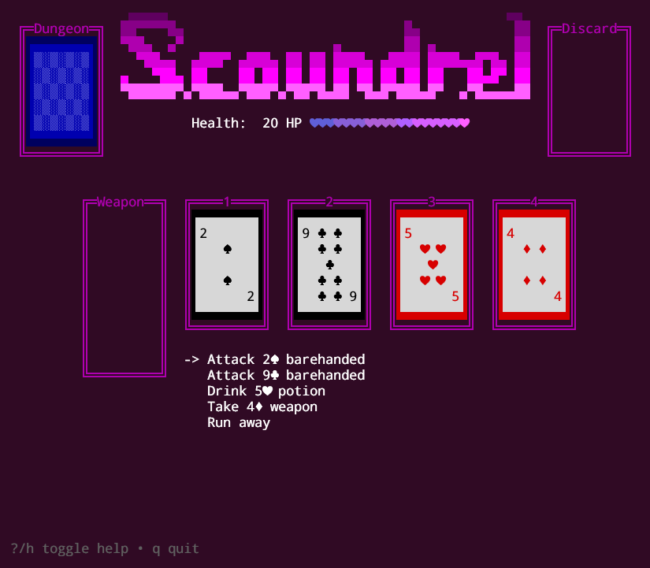

# Scoundrel TUI

Scoundrel Card Game in a Text UI



## Overview

[Scoundrel](http://stfj.net/art/2011/Scoundrel.pdf) is a solo card game originally created by Zach Gage and Kurt Bieg.

## Installation

I'm still actively developing the game and don't have pre-built binaries yet.

### Install From Source

1. Check to see if you have Go installed already
   ```shell
   go version
   ```
   If you don't have go install Go:
   1. From your package manager: e.g. `sudo apt get install golang-go`
   1. With the official [Go installer](https://go.dev/doc/install)
   1. Using [Webi's Go package](https://webinstall.dev/golang/) (Installs in your user profile instead of system wide)
1. Install `scoundrel_tui`
   ```shell
   go install github.com/WadeGulbrandsen/scoundrel_tui@latest
   ```
1. Run the game with:
   #### Linux (Should work on Mac too but untested)
   ```shell
   ~/go/bin/scoundrel_tui
   ```
   #### Powershell
   ```shell
   ~\go\bin\scoundrel_tui.exe
   ```
1. (Optional) Add `$HOME/go/bin` to your path you can just enter `scoundrel_tui` (or `scoundrel_tui.exe` on Windows)
